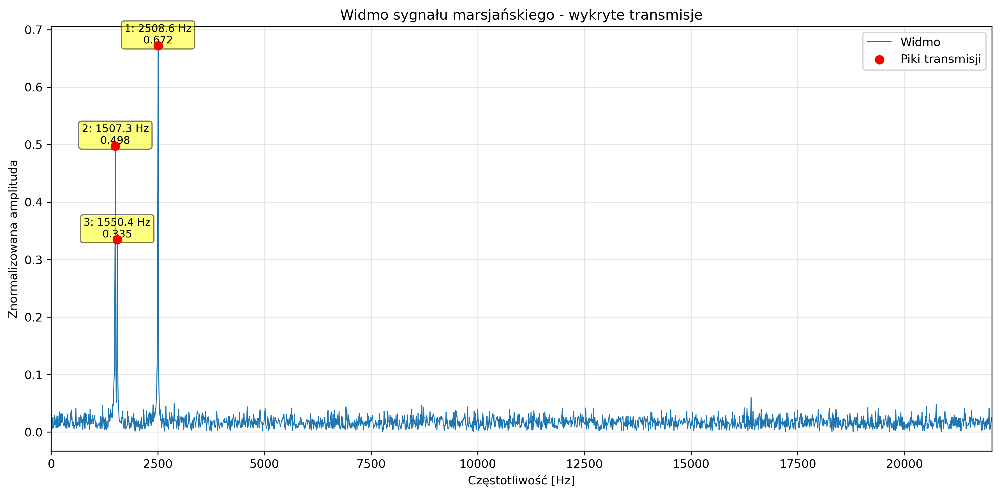
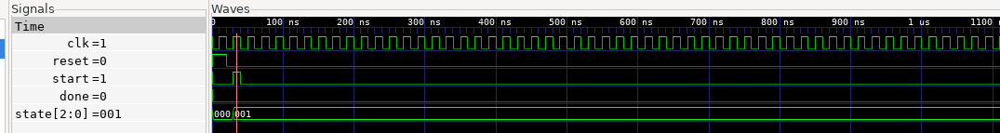
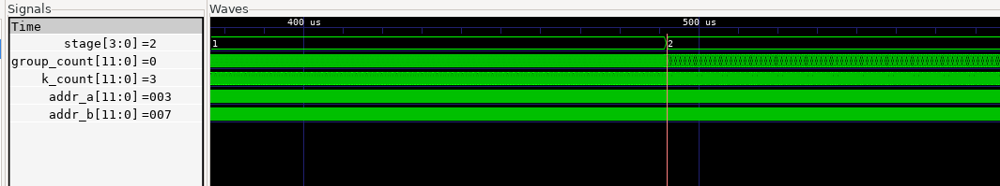
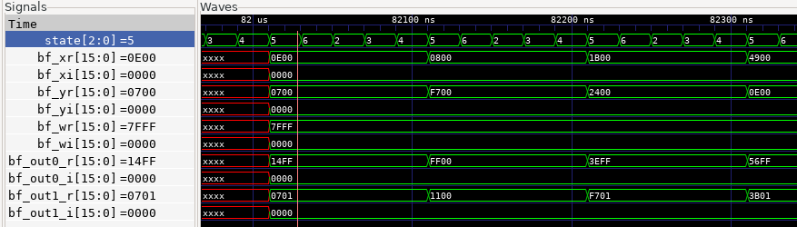

# AresDSP - Mars Rover Signal Analysis System

Sprzętowo-programowy system analizy sygnału z łazika marsjańskiego 
wykorzystujący FFT 4096-punktową do detekcji częstotliwości transmisji.

## Misja

NASA utraciło połączenie z łazikiem marsjańskim podczas misji eksploracyjnej. 
Podejrzewa się, że łazik ciągle próbuje nawiązać komunikację. 
Wykorzystując radioteleskop VLA, nasłuchiwane są sygnały w nadziei na wykrycie transmisji.

**Cel:** 
Zaprojektować i zrealizować system sprzętowo-programowy, 
który pozwoli w jak najkrótszym czasie i jak najdokładniej 
przebadać odebrany sygnał w celu wykrycia zakresu fal, 
na których odbywa się potencjalna transmisja.

---

### Wykryte częstotliwości transmisji łazika:

| Rank | Częstotliwość [Hz] | Amplituda | Status |
|------|-------------------|-----------|---------|
| **1** | **2508.62** | 0.572 |  **GŁÓWNA TRANSMISJA** |
| **2** | **1507.32** | 0.498 |  Subharmoniczna |
| **3** | **1550.39** | 0.335 |  Harmoniczna |

### Wizualizacja widma

<!-- ZRZUT EKRANU #1: Pełny wykres widma z zaznaczonymi pikami -->


**Opis wykresu:** 
Znormalizowane widmo amplitudowe sygnału z zaznaczonymi trzema dominującymi pikami częstotliwościowymi. 
Główna transmisja wykryta na częstotliwości ~2508 Hz.

---

## Architektura Systemu

### Sprzętowa implementacja FFT (SystemVerilog)

- **FFT 4096-punktowa** - Radix-2 Decimation-in-Time (DIT)
- **12 etapów** obliczeniowych (log2(4096) = 12)
- **Dwuportowa RAM** - zoptymalizowana dla bloków M10K (Intel FPGA)
- **Pipeline FSM** - maszyna stanów dla sterowania przepływem danych
- **Butterfly operations** - podstawowe operacje FFT z mnożeniem zespolonym
- **Twiddle factors ROM** - przedgenerowane współczynniki obrotu W_N^k

### schemat blokowy systemu
```
                    ┌─────────────────────────────────────────┐
                    │         FFT 4096 (Top Module)           │
                    │              fft_4096.sv                │
                    └─────────────────────────────────────────┘
                                      │
                ┌─────────────────────┼─────────────────────┐
                │                     │                     │
                ▼                     ▼                     ▼
    ┌───────────────────┐  ┌───────────────────┐  ┌──────────────────┐
    │   ROM Input       │  │   Twiddle ROM     │  │   RAM 4096       │
    │   rom_input.sv    │  │   twiddle_rom.sv  │  │   ram_4096.sv    │
    │                   │  │                   │  │                  │
    │ • 4096 próbek     │  │ • W_N^k factors   │  │ • Dual-port      │
    │ • Q1.15 format    │  │ • 2048 entries    │  │ • 4096×32-bit    │
    │ • Bit-reversed    │  │ • cos/sin LUT     │  │ • M10K optimized │
    └───────────────────┘  └───────────────────┘  └──────────────────┘
                                      │
                                      ▼
                          ┌───────────────────────┐
                          │   Butterfly Unit      │
                          │   butterfly.sv        │
                          │                       │
                          │ • Radix-2 operation   │
                          │ • out0 = x + y·W      │
                          │ • out1 = x - y·W      │
                          │ • 32-bit multiply     │
                          │ • >>15 normalization  │
                          └───────────────────────┘
                                      │
                                      ▼
                          ┌───────────────────────┐
                          │      FSM Control      │
                          │                       │
                          │ IDLE → LOAD → FFT_READ│
                          │   → CALC → WRITE      │
                          │      → DONE           │
                          └───────────────────────┘
                                      │
                                      ▼
                          ┌───────────────────────┐
                          │     Testbench         │
                          │     fft_tb.sv         │
                          │                       │
                          │ • Stimulus generation │
                          │ • VCD dump            │
                          │ • Result extraction   │
                          └───────────────────────┘
```

### Parametry wydajnościowe

- **Czas obliczeń:** ~2.54 ms @ 50 MHz
- **Liczba cykli:** 126,976 (4096 LOAD + 12×2048×5 FFT)
- **Szerokość danych:** 16-bit fixed-point (Q1.15)
- **Przepustowość:** ~1,614,000 próbek/s

---

## Analiza w GTKWave

### Przebieg sygnałów sterujących

<!-- ZRZUT EKRANU #2: GTKWave - sygnały sterujące (clk, reset, start, done, state) -->


**Widoczne sygnały:**
- `clk` - zegar systemowy (50 MHz)
- `reset` - reset asynchroniczny
- `start` - inicjalizacja obliczeń FFT
- `done` - sygnał zakończenia
- `state` - aktualny stan FSM

### Przejścia między etapami FFT

<!-- ZRZUT EKRANU #3: GTKWave - zmiana stage, group_count, k_count -->


**Widoczne sygnały:**
- `stage` - aktualny etap FFT (0-11)
- `group_count` - numer grupy w danym etapie
- `k_count` - indeks motyla w grupie
- `addr_a`, `addr_b` - adresy odczytu/zapisu RAM

### Operacje motyla (butterfly)

<!-- ZRZUT EKRANU #4: GTKWave - szczegóły operacji butterfly -->


**Widoczne sygnały:**
- `bf_xr`, `bf_xi` - wejście X (real, imag)
- `bf_yr`, `bf_yi` - wejście Y
- `bf_wr`, `bf_wi` - współczynnik twiddle
- `bf_out0_r`, `bf_out0_i` - wyjście motyla 0
- `bf_out1_r`, `bf_out1_i` - wyjście motyla 1

---

## Struktura Projektu

```
AresDSP/
│
├── README.md                 
├── Makefile                  
├── signalSample.txt      
│
├── imgs/                     
│
├── hdl/                      
│   ├── butterfly.sv          
│   ├── fft_4096.sv           
│   ├── ram_4096.sv           
│   ├── rom_input.sv          
│   ├── twiddle_rom.sv        
│   └── fft_tb.sv             
│
├── sim/                      
│   ├── fft_output.txt        
│   └── fft_tb.vcd            
│
├── scripts/                  
│   ├── analyze_fft.py        
│   └── generate_twiddle.py   
│
└── results/                  
    ├── widmo_sygnalu.png     
    └── transmission_frequencies.txt
```

---

## Instalacja i Konfiguracja

### Wymagania systemowe

- **Symulator HDL:** Icarus Verilog ≥ 11.0
- **Python:** ≥ 3.8
- **Biblioteki Python:** NumPy, Matplotlib, SciPy
- **GTKWave:** (opcjonalnie) do analizy przebiegów

---

## Szybki Start

### 1. Klonowanie repozytorium
```bash
git clone https://github.com/Vort3x5/AresDSP.git
cd AresDSP
```

### 2. Uruchomienie pełnej analizy
```bash
make all
```

**Wykonane operacje:**
1. Kompilacja modułów SystemVerilog (Icarus Verilog)
2. Uruchomienie symulacji FFT (~2.5 ms czasu symulowanego)
3. Zapis wyników do `sim/fft_output.txt`
4. Analiza częstotliwościowa w Pythonie
5. Generowanie wykresu widma w `results/widmo_sygnalu.png`

### 3. Podgląd przebiegów w GTKWave
```bash
make view
```

---

### Dostępne komendy

```bash
make all      # Symulacja + analiza
make sim      # Tylko symulacja FFT
make analyze  # wykres widma
make view     # Otwórz GTKWave z przebiegami
make clean    # Usuń pliki tymczasowe
make help     # Pomoc
```

## Algorytm FFT

### Implementacja Radix-2 DIT

Transformata Fouriera dla N=4096 próbek:

```
X[k] = Σ(n=0 to N-1) x[n] · e^(-j2πkn/N)
```

**Dekompozycja na 12 etapów:**

Dla każdego etapu `s` (0-11):
- Liczba grup: `N / (2^(s+1))`
- Rozmiar grupy: `2^(s+1)`
- Współczynnik twiddle: `W_N^k = e^(-j2πk/N)`

**Operacja motyla:**
```
out0 = x + y · W_N^k
out1 = x - y · W_N^k
```

### Sekwencja stanów FSM

```
IDLE (0)
  ↓ (start=1)
LOAD (1)
  ↓            
FFT_READ (2)
  ↓
FFT_WAIT (3)
  ↓
FFT_CALC1 (4)
  ↓
FFT_CALC2 (5)
  ↓
FFT_WRITE (6) ─ Zapis wyników
  ↓ (następny motyl lub etap)
  └─────────────────┘
  ↓ 
DONE_STATE (7)
```

---
